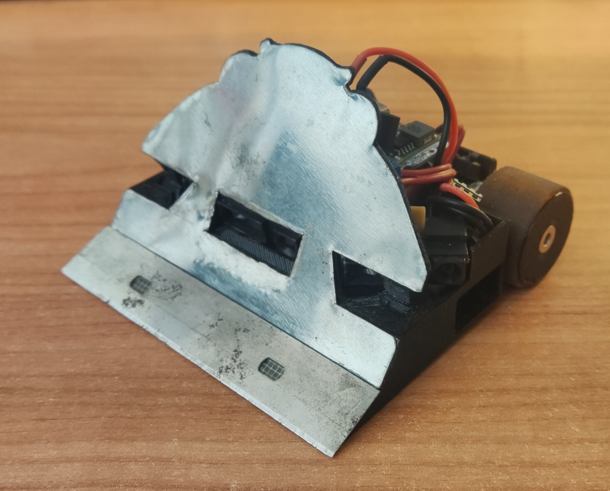
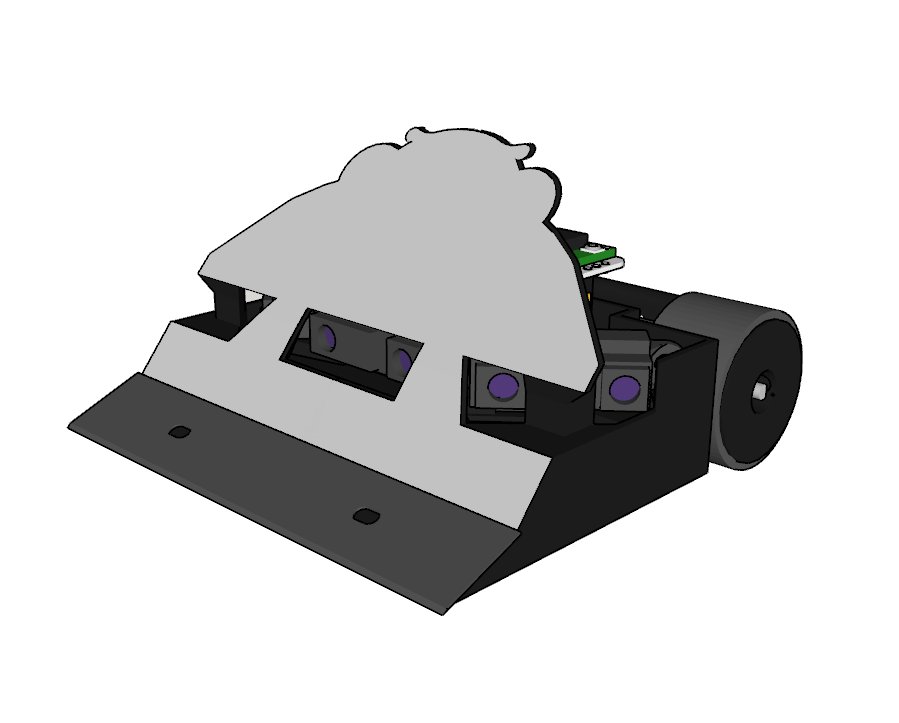

# WapolBot
Robot minisumo con motores Fingertech y triple sensor SHARP

## Hardware
- [PX-Core](https://github.com/OPRobots/PX-CORE)
- 2x Motores Fingertech Silverspark 22:1
- 1x LiPo 2S ~250 mAh
- 3x Sensores SHARP GP2Y0A41SK0F
- 2x Sensores QRE1113
- Goma de ruedas hecha a medida con Uretano/Vitaflex20

## Software
- Programado en c++
- Disponible programa con estrategias y debug de componentes
