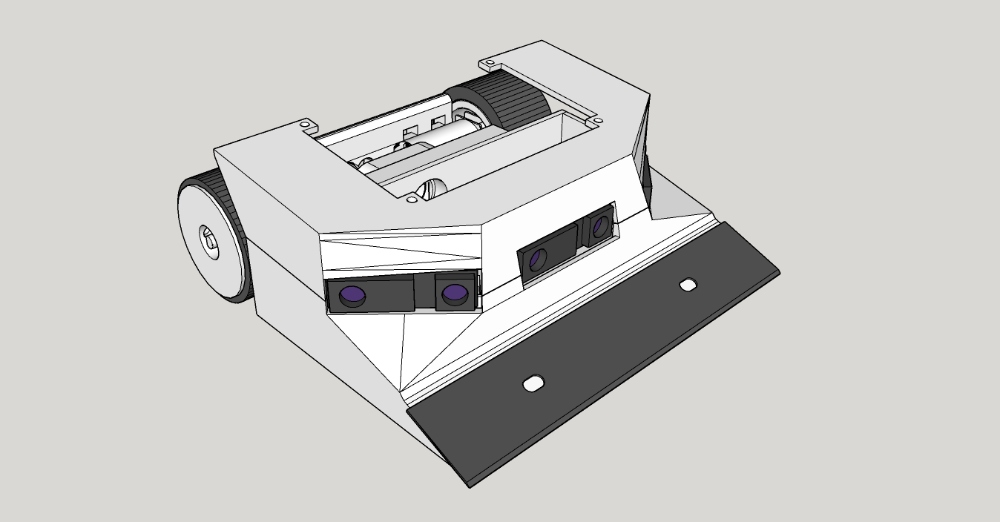

# WapolBot
Robot minisumo con motores Fingertech y triple sensor SHARP

## Hardware
- Arduino Nano
- Driver de motores Pololu Dual MC33926 Motor Driver Carrier
- 2x Motores Fingertech Silverspark 22:1
- 2xLiPo 2S ~250 mAh
- 3x Sensores SHARP GP2Y0A41SK0F
- Goma de ruedas hecha a medida con Uretano/Vitaflex20
- Chasis completamente impreso en PLA

## Software
- Programado con VSCode y PlatformIO
- Disponible programa con estrategias básicas